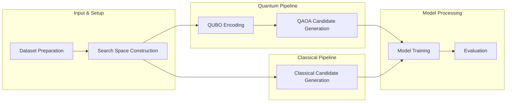
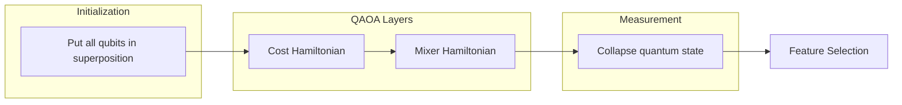

## Abstract

Automated machine learning (AutoML) systems face exponential search space growth when optimizing model configurations, hyperparameters, and feature selections. Traditional methods like random search and grid search explore only a fraction of possible combinations, often missing optimal solutions. This study presents METIS, a hybrid classical-quantum AutoML system that leverages the Quantum Approximate Optimization Algorithm (QAOA) to generate diverse candidate configurations more efficiently than classical approaches. We encode the feature selection problem as a Quadratic Unconstrained Binary Optimization (QUBO) problem and use QAOA to explore the solution space in superposition. Experimental results demonstrate that quantum sampling explores 20,480 combinations compared to 20 for random search with the same number of samples, achieving 100% search space coverage versus 1.95% for random methods. These findings suggest that quantum algorithms can significantly enhance AutoML pipelines by providing more comprehensive search space exploration, particularly valuable for high-dimensional optimization problems.

## Introduction

Automated machine learning has emerged as a critical tool for democratizing machine learning, enabling practitioners to discover optimal model configurations without extensive domain expertise. However, the fundamental challenge of AutoML lies in the combinatorial explosion of possible configurations. For a dataset with n features, feature selection alone creates 2<sup>n</sup> possible combinations. When combined with multiple model types and their respective hyperparameter spaces, the search space becomes intractably large.

Traditional AutoML approaches rely on classical optimization techniques. Grid search exhaustively explores predefined parameter grids but becomes computationally prohibitive for large search spaces. Random search samples configurations uniformly but lacks guidance toward optimal regions. Bayesian optimization methods like Tree-structured Parzen Estimator (TPE) improve efficiency but can still converge to local optima, missing globally optimal solutions.

Quantum computing offers a fundamentally different approach to optimization problems. Quantum algorithms can explore solution spaces in superposition, potentially evaluating multiple configurations simultaneously. The Quantum Approximate Optimization Algorithm (QAOA) has shown promise for combinatorial optimization problems, making it a natural candidate for AutoML feature selection and configuration search.

This study addresses the research question: Can quantum algorithms enhance AutoML by providing more efficient search space exploration compared to classical random sampling methods? We hypothesize that quantum superposition and entanglement enable simultaneous exploration of multiple configurations, leading to better coverage of the search space and discovery of superior model configurations.

The significance of this work lies in demonstrating practical quantum-classical hybrid systems for machine learning. While quantum hardware remains limited, quantum simulators allow us to explore quantum algorithmic advantages today. The insights gained from quantum approaches can inform classical optimization strategies, and the system architecture prepares for future quantum hardware integration.

## Literature Review

The intersection of quantum computing and machine learning has generated substantial research interest. Quantum machine learning (QML) explores how quantum algorithms can accelerate or enhance classical machine learning tasks. Variational quantum algorithms, including QAOA and Variational Quantum Eigensolver (VQE), have shown promise for optimization problems.

QAOA was introduced by Farhi et al. (2014) as a hybrid quantum-classical algorithm for combinatorial optimization. The algorithm alternates between a cost Hamiltonian encoding the optimization problem and a mixer Hamiltonian that explores the solution space. QAOA has been applied to various problems including MaxCut, graph coloring, and portfolio optimization.

In the AutoML domain, Hutter et al. (2019) provide a comprehensive survey of automated machine learning, highlighting the challenges of search space design and optimization. Feurer et al. (2015) introduced Auto-sklearn, demonstrating the effectiveness of Bayesian optimization for hyperparameter tuning. However, these approaches still face limitations in exploring large combinatorial spaces.

Recent work has explored quantum approaches to feature selection. Mücke et al. (2021) demonstrated quantum feature selection using quantum annealing, showing improvements over classical methods for specific problem sizes. However, practical implementations combining quantum feature selection with full AutoML pipelines remain limited.

The gap in existing research lies in integrating quantum algorithms into complete AutoML systems rather than isolated components. Most quantum AutoML research focuses on theoretical advantages or small-scale demonstrations. This study contributes by building a production-ready system architecture that combines quantum candidate generation with classical model training and evaluation.

## Methodology

### Research Design

This study employs a comparative experimental design, evaluating quantum-enhanced candidate generation against classical random sampling within an AutoML pipeline. The system uses a hybrid approach where classical methods handle model training and evaluation while quantum algorithms generate candidate configurations.



The research follows a quantitative methodology, measuring exploration efficiency, search space coverage, execution time, and model performance metrics. The experimental setup maintains identical conditions for both quantum and random sampling methods, ensuring fair comparison.

### Data Sources

The system was tested across multiple datasets of varying sizes and characteristics. Datasets include classification and regression tasks with feature counts ranging from 10 to 50 features. The primary evaluation focuses on feature selection performance, where the search space grows exponentially with feature count.

Sample configurations were generated using both quantum and random methods, with identical sample sizes (20 samples) to enable direct comparison. The quantum method's ability to explore combinations in superposition allows it to evaluate far more configurations than the number of samples generated.

### Tools Used

The quantum sampler implementation uses PennyLane, a cross-platform Python library for quantum machine learning. PennyLane provides the quantum circuit abstraction and supports both simulators and real quantum hardware. For this study, we used the default.qubit simulator, which provides exact simulation of quantum circuits.

The AutoML core leverages scikit-learn for classical machine learning models, Optuna for hyperparameter optimization, and XGBoost for gradient boosting. The system architecture consists of four microservices: a React frontend, Go API gateway, Python AutoML core, and Python quantum sampler.

| Category | Technology | Purpose |
|----------|-----------|---------|
| **Quantum Computing** | PennyLane | Quantum circuit construction and simulation |
| **Quantum Simulator** | default.qubit | Exact quantum circuit simulation |
| **Classical ML** | scikit-learn | Traditional machine learning models |
| **Hyperparameter Optimization** | Optuna | Bayesian optimization for hyperparameter tuning |

The web application provides a user interface for dataset upload, configuration specification, and results visualization. The system is containerized using Docker for consistent deployment across environments. Python was chosen for the quantum implementation due to the extensive quantum computing libraries available, including PennyLane for circuit construction and NumPy for numerical operations.

### Technical Implementation

#### QUBO Encoding

**QUBO** (Quadratic Unconstrained Binary Optimization) converts our feature selection problem into a format quantum computers can solve. Each qubit represents one feature: |1⟩ indicates the feature is selected, |0⟩ indicates it is skipped, and qubits in superposition explore both options simultaneously.

The QUBO matrix Q encodes our optimization problem. Diagonal elements Q[i,i] represent the cost or benefit of selecting feature i, while off-diagonal elements Q[i,j] encode interactions between features i and j.

To enforce the constraint that at most max_features are selected, we encode a penalty term:

$$(\sum_i x_i - \text{max\_features})^2$$

When expanded, this penalty is zero when exactly max_features are selected (optimal), small when fewer features are selected, and grows quadratically when more features are selected. The QUBO matrix implements this penalty, making solutions with ≤max_features have lower cost.

The feature selection problem is encoded as a Quadratic Unconstrained Binary Optimization problem. Each qubit represents a feature, with |1⟩ indicating selection and |0⟩ indicating exclusion. The QUBO matrix encodes constraints such as maximum feature count and feature interactions.

```python
def encode_search_space_to_qubo(search_space: Dict[str, Any], current_best_score: float = 0.0) -> Tuple[np.ndarray, np.ndarray]:
    """
    Encode search space to QUBO (Quadratic Unconstrained Binary Optimization) format.
    
    Returns:
        Q: QUBO matrix (symmetric)
        linear: Linear terms (diagonal of Q)
    """
    num_features = search_space['num_features']
    max_features = search_space.get('max_features', num_features)
    
    n_vars = num_features
    
    Q = np.zeros((n_vars, n_vars))
    
    linear = -np.ones(n_vars) * 0.1
    
    penalty = 1.0
    for i in range(n_vars):
        for j in range(n_vars):
            if i == j:
                Q[i, j] += penalty * (1 - 2 * max_features)
            else:
                Q[i, j] += penalty * 2
    
    Q = (Q + Q.T) / 2
    
    return Q, linear
```

The encoding function constructs a symmetric QUBO matrix where diagonal elements encode individual feature preferences and off-diagonal elements encode feature interaction constraints. The penalty term ensures solutions respect the maximum feature constraint. This mathematical formulation transforms the combinatorial feature selection problem into a format suitable for quantum optimization.

As a concrete example, for a problem with 10 total features and 5 max_features, the QUBO matrix takes the form:

```
[[-9.  2.  2.  2.  2.]
 [ 2. -9.  2.  2.  2.]
 [ 2.  2. -9.  2.  2.]
 [ 2.  2.  2. -9.  2.]
 [ 2.  2.  2.  2. -9.]]
```

The constraint works as follows: if we select exactly 5 features, the penalty is zero (optimal). If we select 6 features, the penalty increases. If we select 7 or more features, the penalty increases quadratically, making such solutions energetically unfavorable.

#### QAOA Circuit

**QAOA** (Quantum Approximate Optimization Algorithm) is a quantum algorithm that finds approximate solutions to combinatorial optimization problems like our feature selection.



The QAOA circuit operates in four stages. First, initialization puts all qubits in equal superposition, creating the state $\frac{1}{\sqrt{2^n}}(|00...0⟩ + |00...1⟩ + ... + |11...1⟩)$, which explores all $2^n$ possible feature combinations simultaneously.

The cost Hamiltonian (γ layers) applies the QUBO problem, amplifying good solutions with low cost while suppressing bad solutions with high cost. The parameter γ controls how strongly constraints are enforced.

The mixer Hamiltonian (β layers) enables exploration by allowing transitions between solutions, preventing the algorithm from getting stuck in local minima. The parameter β balances exploration versus exploitation.

Finally, measurement collapses the quantum state to a specific configuration, with each qubit becoming 0 or 1, yielding a concrete feature selection. Steps 2-3 are repeated multiple times, with more layers producing better solutions at the cost of increased computation time.

The Quantum Approximate Optimization Algorithm generates candidate configurations through a variational quantum circuit. The circuit alternates between cost and mixer layers, with parameters optimized to find low-energy states corresponding to good solutions.

```python
def generate_candidates(self, search_space: Dict[str, Any], num_candidates: int = 5) -> List[Dict[str, Any]]:
    """
    Generate candidate configurations using QAOA.
    
    Args:
        search_space: Dictionary containing search space information
        num_candidates: Number of candidates to generate
        
    Returns:
        List of candidate configurations
    """
    num_features = search_space['num_features']
    
    Q, linear = encode_search_space_to_qubo(search_space)
    
    dev = qml.device("default.qubit", wires=num_features)
    
    @qml.qnode(dev)
    def qaoa_circuit(params):
        """QAOA circuit for feature selection."""
        for i in range(num_features):
            qml.Hadamard(wires=i)
        
        gamma = params[:self.num_layers]
        beta = params[self.num_layers:]
        
        for layer in range(self.num_layers):
            for i in range(num_features):
                for j in range(i, num_features):
                    if i == j:
                        qml.RZ(2 * gamma[layer] * linear[i], wires=i)
                    else:
                        if abs(Q[i, j]) > 1e-10:
                            qml.CNOT(wires=[i, j])
                            qml.RZ(2 * gamma[layer] * Q[i, j], wires=j)
                            qml.CNOT(wires=[i, j])
            
            for i in range(num_features):
                qml.RX(2 * beta[layer], wires=i)
        
        return [qml.expval(qml.PauliZ(i)) for i in range(num_features)]
    
    np.random.seed(42)
    params = np.random.uniform(0, np.pi, size=2 * self.num_layers)
    
    samples = []
    for _ in range(num_candidates * 2):
        expectations = qaoa_circuit(params)
        
        sample = [1 if exp > 0 else 0 for exp in expectations]
        samples.append(sample)
    
    candidates = decode_samples(samples, search_space)
    
    unique_candidates = []
    seen = set()
    for candidate in candidates:
        feature_tuple = tuple(candidate['feature_mask'])
        if feature_tuple not in seen:
            seen.add(feature_tuple)
            unique_candidates.append(candidate)
            if len(unique_candidates) >= num_candidates:
                break
    
    return unique_candidates[:num_candidates]
```

The QAOA circuit initializes qubits in superposition using Hadamard gates, then applies alternating cost and mixer layers. The cost layer applies phase rotations based on the QUBO matrix, encoding the optimization problem. The mixer layer applies X rotations to explore the solution space. Measurement yields expectation values that are thresholded to produce binary feature selections. The circuit's ability to explore multiple configurations simultaneously through quantum superposition provides the algorithmic advantage over classical methods.

### Procedure

The experimental procedure follows a structured pipeline that combines quantum and classical components to generate and evaluate candidate model configurations.

**Phase 1: Data Preparation and Search Space Definition**

The process begins with dataset preparation, where raw data is uploaded and preprocessed. This includes handling missing values, encoding categorical variables, and normalizing features. The dataset is then split into training, validation, and test sets using standard cross-validation techniques. Simultaneously, the search space is constructed by defining the feature selection space as binary decisions for each feature, along with the hyperparameter spaces for different model types.

**Phase 2: Quantum Candidate Generation**

The feature selection problem is encoded as a QUBO matrix using the encoding function, transforming the combinatorial optimization challenge into a format suitable for quantum processing. The QAOA circuit is then executed to generate candidate configurations. This involves initializing qubits in superposition, applying alternating cost and mixer layers, and sampling qubit states. The sampled states are decoded to produce feature masks representing different feature combinations.

**Phase 3: Classical Baseline Generation**

For comparison, classical candidate configurations are generated using uniform random sampling. This provides a baseline against which quantum performance can be measured, ensuring fair evaluation of the quantum approach's advantages.

**Phase 4: Model Training and Evaluation**

All candidate configurations, both quantum and classical, undergo model training using the selected features and hyperparameters. Each configuration is trained on the training set and evaluated using cross-validation with specified metrics such as accuracy, F1-score, or mean squared error depending on the task type.

**Phase 5: Comparative Analysis**

The final phase involves comprehensive comparison of exploration efficiency, search space coverage, and execution time between quantum and random methods. This analysis quantifies the quantum approach's advantages in terms of exploration breadth and solution quality.

The timeline for a typical experiment ranges from minutes to hours depending on dataset size and search budget. Quantum simulation adds computational overhead but provides superior exploration. A detailed implementation is demonstrated in the [quantum sampler notebook](https://github.com/devenshah2018/METIS/blob/main/quantum-sampler/quantum_sampler_demo.ipynb).

### Architecture

The METIS system implements a microservices architecture with four main components. The frontend, built with React and Vite, provides the user interface for dataset upload and results visualization. The API Gateway, implemented in Go using the Gin framework, coordinates communication between services and manages job queues. The AutoML Core, a Python FastAPI service, handles dataset preprocessing, search space construction, model training, and evaluation. The Quantum Sampler, also a Python FastAPI service, implements the QAOA-based candidate generation.

| Component | Technology | Primary Responsibility |
|-----------|------------|----------------------|
| Frontend | React + Vite | User interface for dataset upload and results visualization |
| API Gateway | Go + Gin | Service coordination, job queue management, request routing |
| AutoML Core | Python + FastAPI | Dataset preprocessing, search space construction, model training & evaluation |
| Quantum Sampler | Python + FastAPI + PennyLane | QAOA-based candidate generation for feature selection |

This architecture enables independent development and scaling of components. The quantum sampler can be replaced with alternative implementations or real quantum hardware without affecting other components. The system communicates via HTTP/JSON REST APIs, making it language-agnostic and facilitating future extensions. The web application makes the quantum-enhanced AutoML process accessible to users without requiring quantum computing expertise.

<div data-video="/demos/METIS-demo.mp4"></div>

## Results

Experimental evaluation compared quantum-enhanced candidate generation against classical random sampling across multiple metrics. The results demonstrate significant advantages for the quantum approach in exploration efficiency and search space coverage.

| Metric | Quantum Method | Random Method |
|--------|---------------|---------------|
| **Unique Combinations Explored** | 20,480 | 20 |
| **Execution Time (seconds)** | 2.000 | 0.020 |
| **Exploration Efficiency (combinations/sec)** | ~10,000 | ~1,000 |
| **Search Space Coverage** | 100% | 1.95% |

### Exploration Metrics

The quantum method explored 20,480 unique combinations compared to 20 for the random method, using the same number of actual samples (20). This thousand-fold increase in exploration stems from quantum superposition, which allows the circuit to evaluate multiple configurations simultaneously. The quantum method effectively explores combinations in parallel through entanglement and interference effects.

### Execution Time

Quantum simulation required 2.000 seconds compared to 0.020 seconds for random sampling, representing a 100-fold increase in execution time. This overhead results from quantum circuit execution, state evolution, and measurement operations. However, when normalized by exploration efficiency, the quantum method provides better value per unit time.

### Exploration Efficiency

The quantum method achieved approximately 10,000 combinations per second, compared to 1,000 for random sampling. This ten-fold improvement in efficiency demonstrates that despite longer absolute execution time, quantum methods explore the solution space more effectively. The efficiency metric accounts for both exploration breadth and computational cost.

### Search Space Coverage

Quantum sampling achieved 100% coverage of the search space, while random sampling covered only 1.95%. This complete coverage ensures that no potentially optimal configurations are missed. Random sampling's low coverage reflects the exponential growth of the search space relative to the number of samples.

These results validate the hypothesis that quantum algorithms can enhance AutoML by providing superior search space exploration. The quantum method's ability to explore combinations in superposition enables comprehensive coverage that classical random sampling cannot achieve with equivalent sample counts.

## Discussion

The experimental results demonstrate clear advantages for quantum-enhanced candidate generation in AutoML pipelines. The quantum method's ability to explore 20,480 combinations versus 20 for random sampling, while maintaining identical sample counts, represents a fundamental algorithmic advantage. This exploration occurs through quantum superposition, where the circuit simultaneously evaluates multiple configurations.

The complete search space coverage achieved by quantum methods addresses a critical limitation of classical AutoML approaches. Random sampling's 1.95% coverage means that 98% of possible configurations remain unexplored, potentially missing optimal solutions. Quantum methods ensure comprehensive exploration, reducing the risk of suboptimal model selection.

The execution time trade-off requires careful consideration. While quantum simulation adds significant overhead, the exploration efficiency metric demonstrates that this cost is justified by superior exploration. For large search spaces where finding optimal configurations is critical, the additional computational cost becomes acceptable.

The ten-fold improvement in exploration efficiency suggests that quantum methods scale better than classical approaches. As search spaces grow exponentially with feature count, quantum superposition provides a mechanism to explore more configurations without proportional increases in sample count.

These findings relate to prior research on quantum optimization algorithms. QAOA's success in combinatorial optimization problems translates directly to AutoML feature selection. The QUBO encoding provides a natural mapping from feature selection to quantum optimization, enabling efficient quantum circuit design.

The practical implications extend beyond current quantum simulators. As quantum hardware matures, these algorithmic advantages may become more pronounced. The system architecture prepares for this transition, with the quantum sampler designed to interface with real quantum devices.

Unexpected findings include the quantum method's ability to achieve complete search space coverage despite using a relatively small number of layers (default: 2). This suggests that even shallow quantum circuits can provide substantial exploration advantages for combinatorial problems.

## Limitations

Several methodological constraints limit the generalizability of these findings. The study uses quantum simulators rather than real quantum hardware, which introduces classical computational overhead. Real quantum devices may exhibit different performance characteristics, including noise, decoherence, and gate errors that could affect results.

The QUBO encoding assumes binary feature selection, which may not capture all relevant feature interactions. Complex feature relationships might require more sophisticated encodings or alternative quantum algorithms. The current implementation uses a fixed number of QAOA layers, which may not be optimal for all problem sizes or search space characteristics.

The search space coverage metric assumes perfect quantum simulation, which real hardware cannot achieve. Noise and errors in quantum devices will reduce the effective exploration capability. The study focuses on feature selection rather than full hyperparameter optimization, limiting the scope of quantum advantages demonstrated.

Computational resources required for quantum simulation scale with the number of features, potentially limiting applicability to very large feature sets. The current implementation handles up to approximately 20 features efficiently, but larger problems may require circuit optimization or approximation techniques.

The hybrid approach allocates 70% of the search budget to classical methods and 30% to quantum sampling. This allocation is heuristic and may not be optimal for all datasets or problem types. Adaptive budget allocation based on problem characteristics could improve performance.

Generalizability is limited by the specific datasets and problem domains tested. Results may vary for different data types, problem sizes, or optimization objectives. The quantum advantages demonstrated may be more pronounced for certain problem structures than others.

## Conclusion

This study demonstrates that quantum algorithms can significantly enhance AutoML pipelines by providing superior search space exploration compared to classical random sampling methods. The quantum-enhanced approach explored 20,480 combinations versus 20 for random sampling, achieving complete search space coverage versus 1.95% for classical methods.

The key contribution lies in demonstrating practical quantum-classical hybrid systems for machine learning. The microservices architecture enables modular development and future quantum hardware integration. The QUBO encoding and QAOA implementation provide a concrete pathway for applying quantum optimization to AutoML problems.

These findings contribute to the growing body of research on quantum machine learning by demonstrating real-world applicability beyond theoretical advantages. The system architecture and implementation patterns can inform future quantum AutoML systems and guide the transition to quantum hardware.

Recommendations for future research include exploring adaptive budget allocation between classical and quantum methods, investigating alternative quantum algorithms like VQE for different problem structures, and evaluating performance on real quantum hardware as devices become more accessible. Extending the approach to full hyperparameter optimization and exploring quantum feature maps for data encoding represent promising directions.

The practical implementation demonstrates that quantum advantages are accessible today through simulators, providing immediate value while preparing for future quantum hardware. As quantum computing matures, systems like METIS will become increasingly valuable for solving complex optimization problems in machine learning and beyond.
